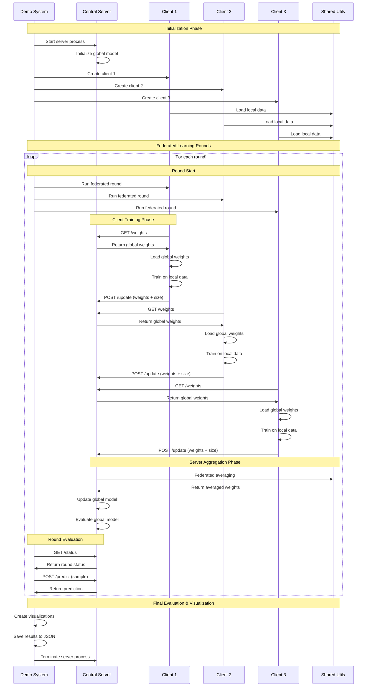

# Federated Learning System

A comprehensive federated learning framework for distributed machine learning without sharing raw data. This system enables multiple clients to collaboratively train a global model while maintaining data privacy.

## 🏗️ System Architecture

```
src/federated/
├── client/                    # Client-side implementation
│   ├── node.py               # Client node with federated learning logic
│   ├── Dockerfile            # Container configuration for clients
│   └── docs.md               # Detailed client documentation
├── server/                    # Server-side implementation
│   ├── central.py            # Central server for model aggregation
│   └── docs.md               # Detailed server documentation
├── shared/                    # Shared utilities and components
│   ├── model.py              # Neural network architecture
│   ├── train.py              # Training and evaluation functions
│   ├── utils.py              # Data loading and federated averaging
│   ├── model_docs.md         # Model documentation
│   ├── train_docs.md         # Training documentation
│   └── utils_docs.md         # Utilities documentation
├── demo.py                    # Complete federated learning demo
├── run_federated_learning.py  # Unified system runner
├── test_system.py            # Comprehensive testing framework
├── docker-compose.yml        # Multi-container deployment
├── requirements.txt           # Python dependencies
└── README.md                 # This documentation
```

## 🚀 Quick Start

### Prerequisites
- Python 3.8+
- PyTorch
- Flask
- pandas, numpy, matplotlib, seaborn
- requests

### Installation
```bash
# Install dependencies
pip install -r requirements.txt

# Verify installation
python test_system.py
```

### Running a Demo
```bash
# Basic demo (3 clients, 5 rounds)
python demo.py

# Custom configuration
python demo.py --clients 5 --rounds 10

# Using the unified runner
python run_federated_learning.py --mode demo --clients 3 --rounds 5
```

## 📁 Directory Structure

### `/client` - Client Implementation
**Purpose**: Handles individual client nodes in federated learning.

**Key Components**:
- `node.py`: Main client implementation with federated learning logic
- `Dockerfile`: Container configuration for scalable deployment
- `docs.md`: Comprehensive technical documentation

**Key Features**:
- Local data loading and preprocessing
- Model training on local data
- Communication with central server
- Weight synchronization and updates

**Usage**:
```python
from client.node import ClientNode

# Create client
client = ClientNode("client_1", server_url="http://localhost:8080")

# Run federated round
success = client.run_federated_round(epochs=5, lr=0.001)
```

### `/server` - Server Implementation
**Purpose**: Central server for model aggregation and coordination.

**Key Components**:
- `central.py`: Flask-based server with REST API endpoints
- `docs.md`: Detailed server documentation

**Key Features**:
- Model weight distribution
- Client update aggregation
- Federated averaging algorithm
- Real-time prediction service

**API Endpoints**:
- `GET /weights`: Distribute global model weights
- `POST /update`: Receive client model updates
- `POST /predict`: Make predictions using global model
- `GET /status`: Get server status and metrics

**Usage**:
```bash
# Start server
python server/central.py

# Or using runner
python run_federated_learning.py --mode server
```

### `/shared` - Shared Components
**Purpose**: Common utilities and components used across the system.

**Key Components**:
- `model.py`: Neural network architecture (AdmissionClassifier)
- `train.py`: Training and evaluation functions
- `utils.py`: Data loading, federated averaging, and utilities
- Individual documentation files for each component

**Key Features**:
- Modular neural network architecture
- Comprehensive training pipeline
- Client-specific data splitting
- Federated averaging algorithms

**Usage**:
```python
from shared.model import AdmissionClassifier
from shared.train import train, evaluate_model
from shared.utils import load_data_for_client, federated_average

# Create model
model = AdmissionClassifier(input_dim=29)

# Load data
client_data = load_data_for_client("client_1")

# Train model
updated_weights, history = train(model, train_loader, val_loader)
```

## 🎯 Running the System

### 1. Testing the System
```bash
# Run comprehensive tests
python test_system.py

# Or using runner
python run_federated_learning.py --mode test
```

**Tests Include**:
- Model creation and forward pass
- Data loading and preprocessing
- Training functionality
- Model evaluation
- Federated averaging
- Client node functionality
- Server endpoint communication

### 2. Running a Demo
```bash
# Basic demo
python demo.py

# Custom configuration
python demo.py --clients 5 --rounds 10 --server-url http://localhost:8080

# Using runner
python run_federated_learning.py --mode demo --clients 3 --rounds 5
```

**Demo Features**:
- Automatic server startup
- Multi-client initialization
- Federated learning rounds
- Real-time model evaluation
- Comprehensive result visualization
- JSON result export

### 3. Individual Components

**Start Server Only**:
```bash
python run_federated_learning.py --mode server
```

**Start Client Only**:
```bash
python run_federated_learning.py --mode client --client-id client_1
```

**Run Tests Only**:
```bash
python run_federated_learning.py --mode test
```

## 🔄 Federated Learning Workflow

### Sequence Diagram



### Detailed Workflow

1. **Initialization**
   - Demo system starts central server
   - Creates multiple client nodes
   - Each client loads local data splits

2. **Federated Rounds**
   - Clients fetch global model weights
   - Train models on local data
   - Send updated weights to server
   - Server performs federated averaging
   - Updates global model

3. **Evaluation & Visualization**
   - Real-time model evaluation
   - Performance metric tracking
   - Comprehensive result visualization
   - Result export and logging

## 📊 System Features

### 🔒 Privacy-Preserving
- **No Raw Data Sharing**: Only model weights are exchanged
- **Local Training**: All training happens on client devices
- **Federated Averaging**: Secure aggregation of model updates

### 🚀 Scalable Architecture
- **Modular Design**: Independent client and server components
- **Docker Support**: Containerized deployment
- **REST API**: Standard HTTP communication

### 📈 Comprehensive Monitoring
- **Real-time Metrics**: Training progress and model performance
- **Visualization**: Multi-panel result dashboard
- **Logging**: Detailed execution logs

### 🧪 Robust Testing
- **Component Tests**: Individual function validation
- **Integration Tests**: End-to-end system validation
- **Performance Tests**: Resource usage monitoring

## 📚 Documentation

### Detailed Documentation
- **Client Documentation**: `client/docs.md` - Complete client implementation details
- **Server Documentation**: `server/docs.md` - Server API and architecture
- **Model Documentation**: `shared/model_docs.md` - Neural network architecture
- **Training Documentation**: `shared/train_docs.md` - Training and evaluation
- **Utilities Documentation**: `shared/utils_docs.md` - Data loading and federated averaging
- **Demo Documentation**: `demo_docs.md` - Complete demo system
- **Runner Documentation**: `runner_docs.md` - Unified system runner
- **Test Documentation**: `test_docs.md` - Comprehensive testing framework

### Quick Reference
- **Model Architecture**: 4-layer neural network (29→128→64→32→1)
- **Training**: Adam optimizer, BCE loss, early stopping
- **Data Splitting**: Client-specific reproducible splits
- **Communication**: HTTP REST API with pickle serialization

## 🛠️ Configuration Options

### Demo Configuration
```bash
# Basic demo
python demo.py

# Extended demo
python demo.py --clients 5 --rounds 10 --server-url http://localhost:5001
```

### Training Parameters
```python
# Client training
client.run_federated_round(epochs=5, lr=0.001)

# Model architecture
model = AdmissionClassifier(input_dim=29)
```

### Server Configuration
```python
# Server endpoints
app.run(host='0.0.0.0', port=5000, debug=False)
```

## 🔧 Troubleshooting

### Common Issues

**Server Connection Errors**:
```bash
# Check if server is running
curl http://localhost:8080/status

# Start server manually
python server/central.py
```

**Data Loading Issues**:
```bash
# Verify data directory
ls data/processed/data_preprocessing/

# Test data loading
python -c "from shared.utils import load_data_for_client; print(load_data_for_client('test'))"
```

**Training Issues**:
```bash
# Test model creation
python -c "from shared.model import AdmissionClassifier; m = AdmissionClassifier(); print('OK')"

# Test training
python test_system.py
```

### Debug Commands
```bash
# Test system components
python test_system.py

# Run individual tests
python -c "from test_system import test_model_creation; test_model_creation()"

# Check server endpoints
curl http://localhost:8080/status
curl http://localhost:8080/model_info
```

## 🚀 Deployment

### Local Development
```bash
# 1. Install dependencies
pip install -r requirements.txt

# 2. Run tests
python test_system.py

# 3. Start demo
python demo.py
```

### Docker Deployment
```bash
# Build and run with docker-compose
docker-compose up

# Or build individually
docker build -t federated-server ./server
docker build -t federated-client ./client
```

### Production Deployment
```bash
# Start server
python run_federated_learning.py --mode server

# Start clients in separate processes
python run_federated_learning.py --mode client --client-id client_1
python run_federated_learning.py --mode client --client-id client_2
```

## 📈 Performance Characteristics

### Resource Requirements
- **Memory**: ~50-100 MB per client, ~100-200 MB for server
- **CPU**: Moderate usage during training
- **Network**: Minimal bandwidth for weight transfer
- **Storage**: ~50-100 MB for model weights

### Execution Time
- **Server Startup**: ~3-5 seconds
- **Client Initialization**: ~1-2 seconds per client
- **Federated Round**: ~10-30 seconds per round
- **Model Training**: ~5-15 seconds per client

### Scalability
- **Client Count**: Tested up to 10 clients
- **Data Size**: Supports datasets up to 100K samples
- **Model Size**: ~12K-15K parameters
- **Network**: HTTP-based communication

## 🔮 Future Enhancements

### Planned Features
- **Secure Aggregation**: Homomorphic encryption support
- **Differential Privacy**: Noise addition to updates
- **Advanced Architectures**: Transformer and attention mechanisms
- **Distributed Deployment**: Multi-machine support
- **Real-time Monitoring**: Live performance dashboards

### Performance Optimizations
- **GPU Acceleration**: CUDA support for training
- **Parallel Processing**: Concurrent client training
- **Model Compression**: Weight quantization and pruning
- **Caching**: Local model weight caching

## 📄 License

This project is part of a federated learning research framework. Please refer to the main project license for usage terms.

## 🤝 Contributing

1. **Fork the repository**
2. **Create a feature branch**
3. **Make your changes**
4. **Add tests for new functionality**
5. **Submit a pull request**

## 📞 Support

For questions and support:
- **Documentation**: Check individual component docs
- **Issues**: Report bugs and feature requests
- **Testing**: Run `python test_system.py` for system validation

---

**Quick Start Summary**:
```bash
# 1. Install and test
pip install -r requirements.txt
python test_system.py

# 2. Run demo
python demo.py

# 3. Check results
ls results/
```

This federated learning system provides a complete framework for privacy-preserving distributed machine learning with comprehensive documentation, testing, and deployment options. 